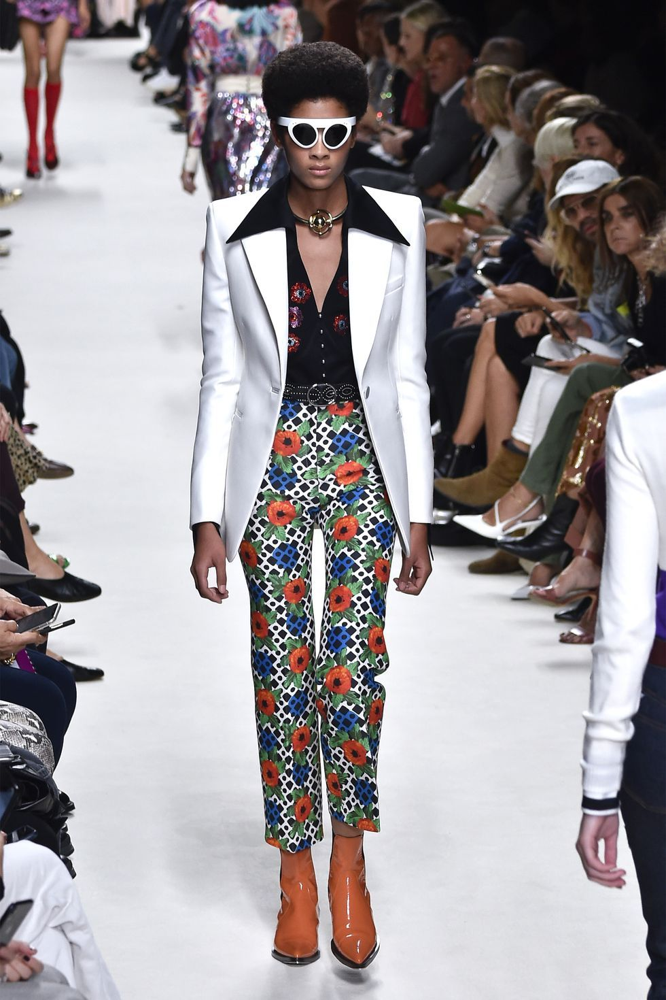
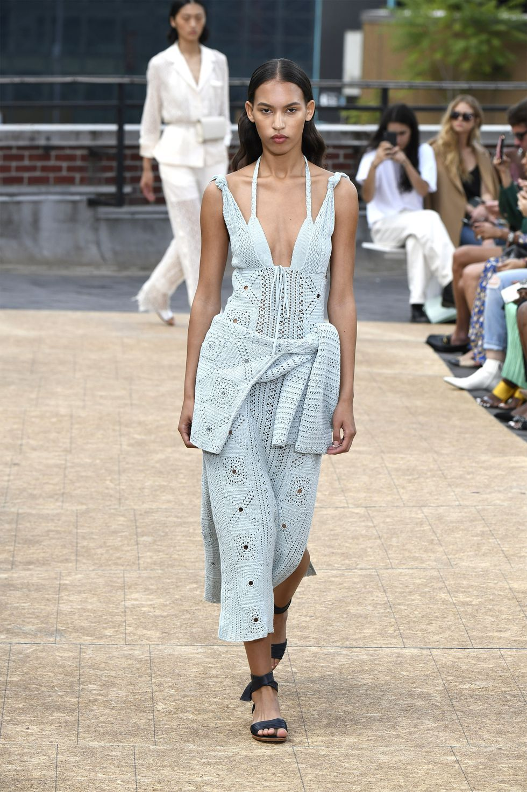
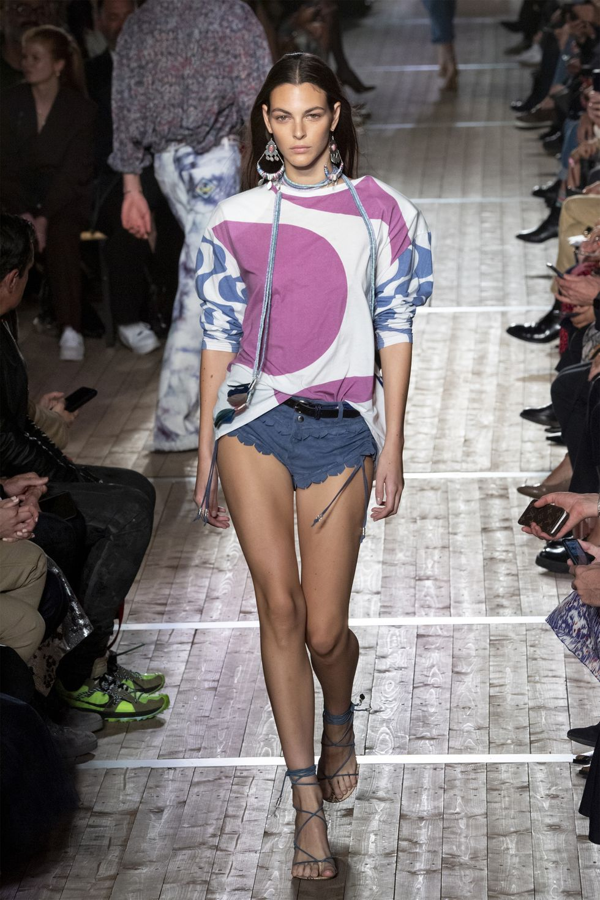

# 3 Standout Trends That Ruled the Spring 2020 Runways

The long parade of more than 100 fashion shows during the spring 2020 season, which took place few months ago, has finally come to market. The first order of business is discerning the most impactful trends of the season—from artisanal crochet and graphic polka dots to a look at decades past via disco collars and '60s wallpaper prints, couture feathers, hot pants, bold neons, and many more. See which designers led the pack for each new mode before you give your wardrobe a refresh. Welcome to what's now.

### The Disco Collar

And just like that disco’s not dead. The wide collar favored by the Studio 54 set made a surprise comeback on the spring 2020 runways. Modernized on coats, jackets, and button-downs at Lanvin, Ferragamo, JW Anderson, and beyond, the look is often shown with contrasting colors to make it really stand out. Because what’s the point of a super collar if you can’t really see it?

### Not Your Grandmother’s Crochet

Crochet is getting a cool update come spring. Think ultra-feminine dresses, polished suiting, and eveningwear that feels modern with a special touch of Grandma’s handmade crochet. As the fashion industry looks for ways to become more sustainable, there’s something special about a “trend” that embraces a slow, handmade technique that can be passed down generation after generation—à la that treasured family heirloom that lasts forever.

### Some Like It Hot Pants

Who wears short shorts? A lot of us. Hot pants staged a triumphant comeback on the spring 2020 runways—from itty bitty knit shorts at Hermès and Ferragamo to denim cutoffs at Rag & Bone and spandex at Brandon Maxwell. For those who'd rather ease into Daisy Duke status, Chanel styled the look with black tights.

